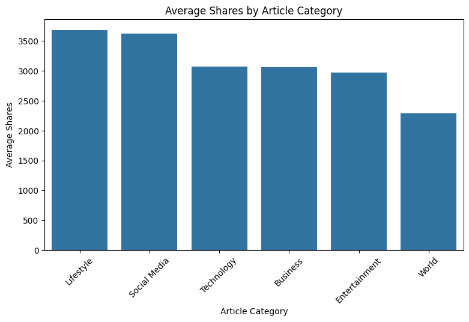
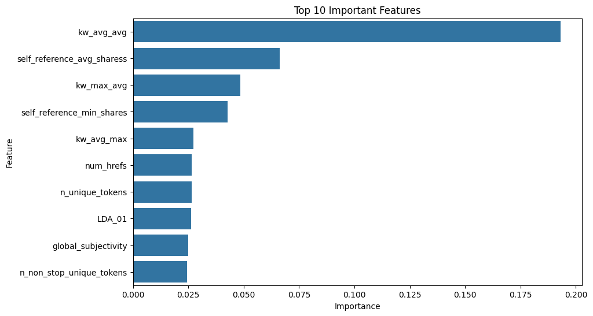
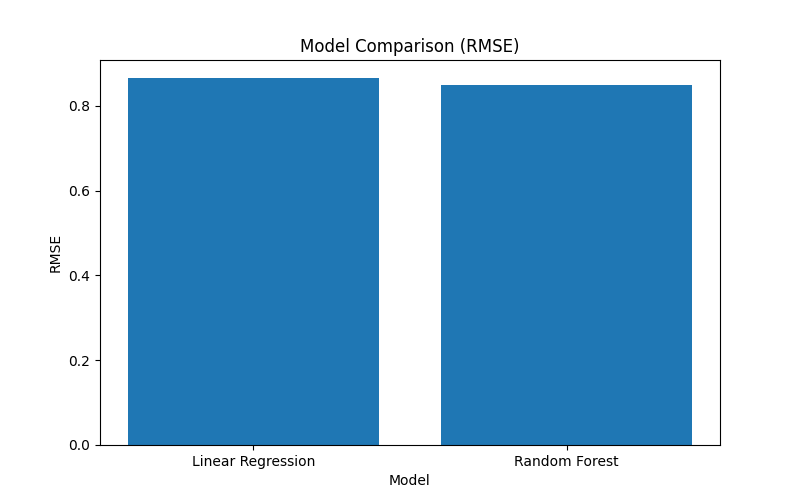

# 📊 Online News Popularity Prediction

A complete end-to-end data science project using **Python, SQL, and Machine Learning** to analyse and predict the popularity of online news articles.

---

## 🚀 Project Overview
This project explores what drives engagement in online news by analysing over **39,000 articles** and building predictive models to estimate social media shares.

The goal is to simulate a real-world scenario where publishers can **predict article performance before publication** and optimise their content strategy.

---

## 🎯 Objectives
- Clean and prepare a real-world dataset
- Perform SQL-based exploratory analysis
- Visualise engagement trends
- Build machine learning models to predict article popularity
- Identify key factors influencing article shares

---

## 🛠️ Tech Stack
- **Python**: Pandas, NumPy, Scikit-learn
- **SQL**: SQLite
- **Visualisation**: Matplotlib, Seaborn
- **Machine Learning**: Linear Regression, Random Forest
- **Version Control**: Git & GitHub

---

## 📁 Project Structure

```text
online-news-popularity-prediction/
│
├── data/
│   ├── raw/
│   │   └── OnlineNewsPopularity.csv
│   │
│   └── processed/
│       └── cleaned_online_news.csv
│
├── images/
│   ├── shares_distribution.png
│   ├── feature_importance.png
│   └── model_comparison.png
│
├── notebooks/
│   ├── 01_data_cleaning.ipynb
│   ├── 02_sql_analysis.ipynb
│   ├── 03_eda_visualisation.ipynb
│   └── 04_model_building.ipynb
│
├── sql/
│   └── analysis_queries.sql
│
├── src/
│   ├── predict.py
│   └── random_forest_model.pkl
│
├── README.md
├── requirements.txt
└── .gitignore
```

## 🧹 Data Cleaning & Preparation
- Removed irrelevant columns (`url`, `timedelta`)
- Cleaned column names for SQL compatibility
- Verified no missing values or duplicates
- Applied log transformation to the target variable (`shares`) to handle skewness

---

## 🧠 SQL Analysis
SQL queries were used to extract insights such as:
- Top-performing article categories
- Best publishing days for engagement
- Impact of images and videos on shares
- Relationship between article length and popularity

Example:

```sql
SELECT
    COUNT(*) AS total_articles,
    ROUND(AVG(shares), 2) AS average_shares
FROM news;
```

## 📊 Exploratory Data Analysis

Key findings:

- Article shares are highly skewed
- Content category strongly influences engagement
- Multimedia (images/videos) shows moderate impact
- Publishing day affects performance

## 🤖 Machine Learning Models
**Models Used**
- Linear Regression (baseline)
- Random Forest Regressor

**Evaluation Metrics**
- RMSE (Root Mean Squared Error)
- R² Score

**Result**
Random Forest outperformed Linear Regression, capturing non-linear relationships in the data.

| Model | RMSE | R² Score |
|---|---:|---:|
| Linear Regression | 0.865 | 0.127 |
| Random Forest | 0.849 | 0.160 |

The Random Forest model outperformed Linear Regression, achieving a lower RMSE and higher R² score. This indicates that non-linear models are better suited for capturing the complex relationships between article features and popularity.

A prediction script (`src/predict.py`) is included to demonstrate how the trained model can be used for real-world predictions.

## 🔍 Feature Importance

Top factors influencing article popularity:
- Number of keywords
- Article length
- Social media references
- Multimedia usage

## 💡 Key Insights

- Articles with more keywords tend to perform better
- Technology and entertainment categories drive higher engagement
- Mid-week publishing often results in more shares
- Multimedia improves visibility but not always engagement

## 💼Business Impact

This project demonstrates how data-driven insights can:

- Improve content strategy
- Increase audience engagement
- Support editorial decision-making
- Predict high-performing articles

## ▶️ How to Run

1. Clone the repository:

```bash
git clone https://github.com/dd4real2k/online-news-popularity-prediction.git
cd online-news-popularity-prediction
```

2. Install dependencies:
```
pip install -r requirements.txt
```
3. Run the prediction script:

```
python src/predict.py
```

4. Run the App
```
streamlit run app.py
```

## 🌐 Live Demo

Try the interactive dashboard here:

[Launch Streamlit App](YOUR_STREAMLIT_LINK_HERE)

## 📌 Future Improvements
- Hyperparameter tuning (GridSearchCV)
- Streamlit dashboard for live predictions
- API deployment (FastAPI)
- Integration with real-time data sources

## 📊 Visual Insights

### Distribution of Shares


### Feature Importance


### Model Comparison (RMSE)

